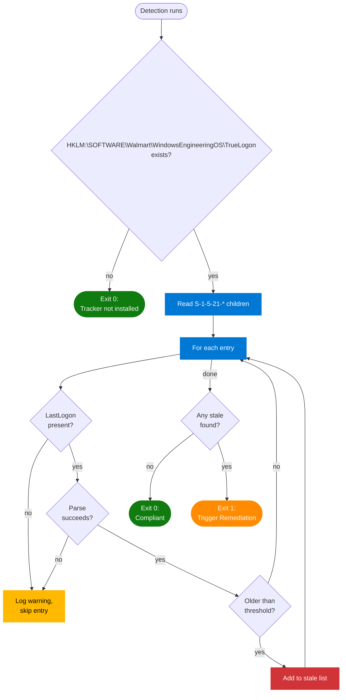
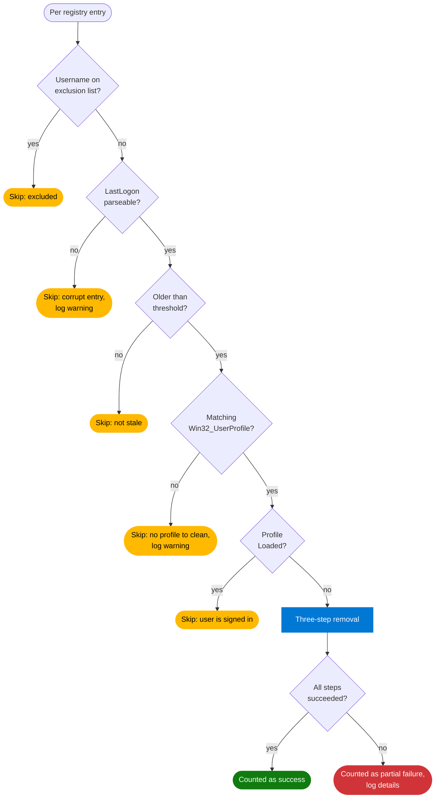
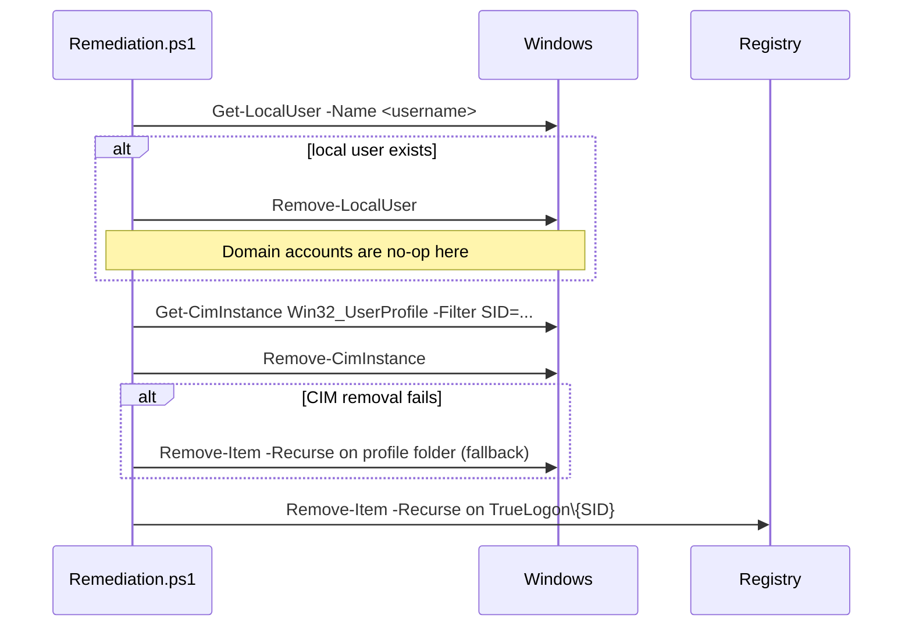

# Cleanup (Proactive Remediation)

The cleanup half of [True Logon](../README.md). Reads the per-user `LastLogon` timestamps that the [Tracker](../Tracker/README.md) maintains in `HKLM:\SOFTWARE\Walmart\WindowsEngineeringOS\TrueLogon`, and removes profiles that have gone stale.

This document is a technical walkthrough of the scripts in this folder.

---

## Contents

| File | Purpose |
|---|---|
| `Detection.ps1` | Intune Proactive Remediation detection rule. Asks "is there any cleanup work to do?" |
| `Remediation.ps1` | Does the cleanup. Removes the local user account, the profile folder, and the registry entry. |
| `README.md` | This document. |

## Dependency on the Tracker

This component reads but never writes the registry data that drives it. The [Tracker](../Tracker/README.md) Win32 app owns `HKLM:\SOFTWARE\Walmart\WindowsEngineeringOS\TrueLogon`. If the Tracker isn't installed on a device, Detection exits compliant (no-op) and Remediation is never called.

Both scripts must agree on:

- The registry root: `HKLM:\SOFTWARE\Walmart\WindowsEngineeringOS\TrueLogon`
- The `LastLogon` format: `yyyy-MM-ddTHH:mm:ss` (strict parse — drift throws loudly)
- The staleness threshold: `-DaysThreshold 90` by default, in both scripts

The threshold value isn't shared between the two scripts at runtime (they deploy independently). If you change the default in one, change it in the other too.

---

## `Detection.ps1` — walkthrough



### Exit codes

| Exit | Meaning |
|---|---|
| `0` | Compliant — no stale profiles found, OR the Tracker isn't installed |
| `1` | Non-compliant — at least one stale profile; Intune calls Remediation |
| `2` | Critical error reading the registry |

### Why "no Tracker installed" returns compliant

Detection is part of a Proactive Remediation. If it returns 1, Intune runs Remediation. But Remediation needs the Tracker's registry to function — it would just error out. So Detection short-circuits to compliant when the Tracker isn't there, leaving Remediation alone. The dependency is documented; this just makes its absence a no-op instead of a noisy failure.

### Why skipped entries don't trigger Remediation

An entry with a missing or unparseable `LastLogon` is corrupt or partial — possibly mid-write during a tracker run. Triggering Remediation on the assumption "we can't tell, so assume stale" would be aggressive and could remove an active user. Instead, Detection logs a warning, skips the entry, and the next cycle picks it up once the value is healthy.

### Strict date parsing

```powershell
[DateTime]::ParseExact($lastLogonStr, 'yyyy-MM-ddTHH:mm:ss', $null)
```

This format is the contract. If the tracker ever starts writing a different shape (milliseconds, `Z` suffix, timezone offset), `ParseExact` throws on the first record. Both Detection and Remediation react the same way — log and skip — which makes a format-drift bug visible immediately rather than silently degrading.

### Single-gate logic

This script used to have a two-gate check: "profile count > 30 AND at least one stale." The count gate was dropped because the count threshold doesn't change the fact that a stale profile is a stale profile, regardless of how many neighbors it has. If you want to limit cleanup to higher-profile machines, that's a deployment-time choice, not something to bake into the gate logic.

---

## `Remediation.ps1` — walkthrough

Intune only invokes Remediation when Detection has flagged stale profiles. Remediation re-walks the registry (it doesn't trust a snapshot — state could have changed) and processes each user.

### Per-user safety filter



Each filter exists for a specific reason:

- **Exclusion list** (`Default`, `Public`, `Administrator`, `Moonpie`, plus any caller-supplied `-ExcludeUsers`) — service accounts and local admin accounts that look like regular users but must never be removed.
- **`LastLogon` parseable** — corrupt or partial entries shouldn't drive a deletion decision (same rationale as Detection).
- **Older than threshold** — Detection's job is to find at least one stale entry; Remediation re-checks because the registry could have changed between cycles.
- **Matching `Win32_UserProfile`** — if Windows doesn't think the profile exists on this device, there's nothing for us to clean. Could be a leftover registry entry from a profile that was already removed by other means.
- **`Loaded` check** — if the profile is currently loaded (someone is signed in), removing it would break their session. Skip this round; we'll get them next time.

### Three-step removal

For each user that passes all filters:



Each step is wrapped in its own try/catch. A failure in any one step is recorded, the other steps still attempt, and the overall result is reported as "partial" rather than the function bailing out completely. This means a registry-key removal failure doesn't leave a dangling profile folder on disk just because the registry entry was locked.

### Exit codes

| Exit | Meaning |
|---|---|
| `0` | Clean run — every targeted profile was removed successfully (or there were none to target) |
| `1` | Partial failure — at least one user couldn't be fully removed; check the log |

A `$RemediationErrors` counter increments on:

- Any `Remove-UserProfileSafely` call that reported a partial failure (one of the three steps threw)
- Any exception that escapes the per-user try/catch in the main loop

If the counter is non-zero at the end, the script exits 1. Intune surfaces this as a failed remediation and tries again next cycle.

### `-WhatIf`

Every state-changing operation is gated on `$WhatIf`. Running `Remediation.ps1 -WhatIf` walks the entire flow — identifies stale profiles, computes disk usage, evaluates safety filters — but performs no deletes. It's the way to preview what would happen on a given device.

---

## Logging

CMTrace format, 5 MB rotation, lives in `C:\ProgramData\TrueLogon\Logs\`.

| File | Written by |
|---|---|
| `TrueLogon-ProfileDetection.log` | `Detection.ps1` — per-cycle compliance verdict, list of stale entries found, any skipped entries |
| `TrueLogon-Remediation.log` | `Remediation.ps1` — per-user disposition (skipped/removed/failed), final summary with failure count |

Detection also writes its summary to stdout, which Intune captures and surfaces in the portal output column.

---

## Parameters

| Script | Parameter | Default | Notes |
|---|---|---|---|
| `Detection.ps1` | `-DaysThreshold` | `90` | Stale-after threshold in days |
| `Remediation.ps1` | `-DaysThreshold` | `90` | Stale-after threshold (keep matched to Detection) |
| `Remediation.ps1` | `-WhatIf` | off | Dry run — log what would happen, change nothing |
| `Remediation.ps1` | `-ExcludeUsers` | `@()` | Additional usernames to skip (appended to the built-in list) |
