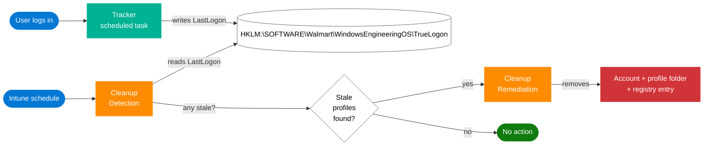

# True Logon

> Tracks Windows logons and cleans up stale user profiles before they become a problem.

---

## Why this exists

Shared and multi-user Windows devices accumulate user profiles over time — former employees, test accounts, one-time users, contractors. Each profile takes disk space, but the bigger problem is that **Windows feature updates can fail when the profile count gets large** because the in-place upgrade has to process each one.

The obvious solution — "just delete old profiles" — turns out to be hard, because Windows' own per-profile timestamps lie. Antivirus scans, search indexer, GPO refresh, OneDrive sync, and a dozen other background services touch profile folders without the user ever logging in. So you can't trust the file system to tell you "when did this user last actually use this machine."

True Logon solves this by recording an accurate, tamper-resistant **"last logon" timestamp per user, in the registry**, written only when the user actually signs in. A separate cleanup component reads those timestamps and removes profiles that have been inactive past a threshold.

---

## How it works

Two Intune-deployed components, one shared contract (the registry):

- **Tracker** (`Tracker/`) — A Win32 app. Installs a scheduled task that fires at every interactive logon and stamps the user's `LastLogon` timestamp under `HKLM:\SOFTWARE\Walmart\WindowsEngineeringOS\TrueLogon\{SID}`.
- **Cleanup** (`ProactiveRemediationScripts/`) — A Proactive Remediation script package. On Intune's schedule, Detection reads the registry; if it finds any entry older than the staleness threshold, Remediation removes the corresponding profile.

Neither component knows about the other directly. The registry is the contract between them.

---

## Deploy

### 1. Tracker (Win32 app)

Package the contents of `Tracker/` into an `.intunewin` file with Microsoft's `IntuneWinAppUtil.exe`, then upload as a Win32 app in Intune.

| Field | Value |
|---|---|
| Install command | `PowerShell.exe -ExecutionPolicy Bypass -NoProfile -File .\Install.ps1` |
| Uninstall command | `PowerShell.exe -ExecutionPolicy Bypass -NoProfile -File .\Install.ps1 -Uninstall` |
| Install behavior | System |
| Detection rule | Scripted — upload `Tracker/Detection.ps1` |

### 2. Cleanup (Proactive Remediation)

Create an Intune Proactive Remediation script package:

| Field | Value |
|---|---|
| Detection script | `ProactiveRemediationScripts/Detection.ps1` |
| Remediation script | `ProactiveRemediationScripts/Remediation.ps1` |
| Run as | System |
| PowerShell architecture | 64-bit |

Deploy the Tracker first. Cleanup's Detection exits compliant (no-op) on devices that don't have the Tracker installed.

---

## Documentation

- **[Tracker/README.md](Tracker/README.md)** — technical walkthrough of the installer, the embedded tracker, and the Win32 detection rule.
- **[ProactiveRemediationScripts/README.md](ProactiveRemediationScripts/README.md)** — technical walkthrough of the Cleanup detection and remediation.
