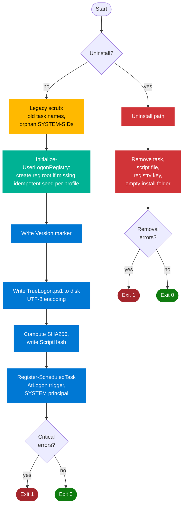
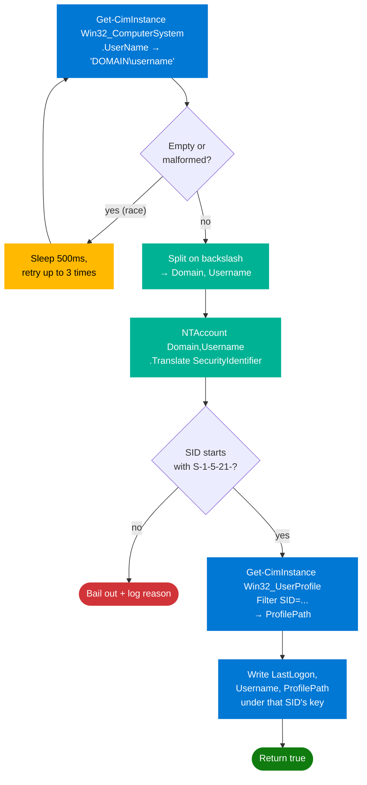

# Tracker

The Win32-app half of [True Logon](../README.md). On install, it sets up the device to record an accurate "last logon" timestamp under `HKLM:\SOFTWARE\Walmart\WindowsEngineeringOS\TrueLogon\{SID}` every time a user signs in. The [Cleanup component](../ProactiveRemediationScripts/README.md) consumes those timestamps to decide which profiles to remove.

This document is a technical walkthrough of the scripts in this folder.

---

## Contents

| File | Purpose |
|---|---|
| `Install.ps1` | Installer and uninstaller. Sets up the tracking infrastructure or tears it down. |
| `Detection.ps1` | Intune Win32 app detection rule. Verifies the install is intact and at the expected version. |
| `README.md` | This document. |

> `IntuneWinAppUtil.exe` is not committed to the repo. Download Microsoft's [Win32 Content Prep Tool](https://learn.microsoft.com/en-us/mem/intune/apps/apps-win32-prepare) when you need to package an `.intunewin`.

---

## Intune Win32 app setup

Package the `Tracker/source/` folder with `Install.ps1` as the setup file:

```
IntuneWinAppUtil.exe -c Tracker\source -s Install.ps1 -o <output-folder>
```

Configure the Intune app with these exact commands:

| Field | Value |
|---|---|
| Install command | `powershell.exe -ExecutionPolicy Bypass -NoProfile -File Install.ps1` |
| Uninstall command | `powershell.exe -ExecutionPolicy Bypass -NoProfile -File Install.ps1 -Uninstall` |
| Install behavior | System |
| Device restart behavior | No specific action |
| Detection rule | Custom script — upload `Tracker/Detection.ps1` |
| Run script as 32-bit on 64-bit clients | No |
| Enforce script signature check | No |

`Install.ps1` handles both install and uninstall — the `-Uninstall` switch reverses everything (scheduled task, tracker script, registry root). Detection is uploaded directly to Intune as the detection rule; it is **not** bundled inside the `.intunewin`.

---

## What gets deployed

Once `Install.ps1` runs successfully on a device, the following artifacts exist:

| Artifact | Location |
|---|---|
| Tracker script | `C:\ProgramData\TrueLogon\TrueLogon.ps1` |
| Scheduled task | `TrueLogon` (AtLogon trigger, runs as SYSTEM) |
| Registry root | `HKLM:\SOFTWARE\Walmart\WindowsEngineeringOS\TrueLogon` |
| Version marker | `HKLM:\SOFTWARE\Walmart\WindowsEngineeringOS\TrueLogon\Version` (e.g. `2.0.3`) |
| Script integrity hash | `HKLM:\SOFTWARE\Walmart\WindowsEngineeringOS\TrueLogon\ScriptHash` (SHA256 of the tracker file) |
| Per-user logon record | `HKLM:\SOFTWARE\Walmart\WindowsEngineeringOS\TrueLogon\{S-1-5-21-...}` — `Username`, `LastLogon`, `ProfilePath` |
| Log directory | `C:\ProgramData\TrueLogon\Logs\` |

`LastLogon` is always written in `yyyy-MM-ddTHH:mm:ss` format. Both this folder's `Detection.ps1` and the Cleanup scripts parse it strictly — drift in the format will throw on the first record, which is the intended loud failure.

---

## `Install.ps1` — walkthrough

`Install.ps1` runs as SYSTEM (via Intune) or as Administrator (manual). The default mode is install; `-Uninstall` reverses everything. `-WhatIf` simulates without changes.



### Legacy scrub

Two loops at the top of the script remove artifacts from previous versions or the prior buggy tracker:

1. **Old task names** — `User Logon Registry Stamp`, `UserLogonTracking`, `TrackUserLogon`. Uses `schtasks.exe /Delete /F` (fast, no-op when the task isn't present). Not the current `TrueLogon` task (you don't delete the task you're about to register).
2. **Orphan system-SID entries** — `S-1-5-18`, `S-1-5-19`, `S-1-5-20` keys under `HKLM:\SOFTWARE\Walmart\WindowsEngineeringOS\TrueLogon`. These were written by the pre-2.0.1 tracker, which had a bug that stamped under SYSTEM's SID instead of the logged-in user's. See the [Tracker walkthrough](#truelogonps1--the-tracker-script) below for the fix.

These run unconditionally on every invocation (install or uninstall). If nothing is present, no log noise — only successful removals are logged.

### `Initialize-UserLogonRegistry` — idempotent seed

For each existing user profile on the device (filtered to `S-1-5-21-*` real users, excluding the built-in list), the installer ensures a registry entry exists with `Username`, `ProfilePath`, and `LastLogon`.

The **idempotency** is the important part. Three things determine what happens for each user:

1. The key always exists after this step (`New-Item -Force`).
2. `Username` and `ProfilePath` are always refreshed (they can legitimately change).
3. **`LastLogon` is only written if it doesn't already have a value.**

The third rule is why upgrades don't wipe history. Without it, every redeploy — including the ones triggered by `Detection.ps1` failing for any reason (version bump, tampered script, disabled task) — would reset every user's tracked `LastLogon` to install day. The tracker's accumulated record would be useless after the first upgrade.

New entries get a `LastLogon` seeded from the profile folder's `LastWriteTime` — a much better approximation of real last-use than "today," which would force a full grace period before any pre-existing profile became eligible for cleanup. If the profile folder is missing or unreadable, the seed falls back to the current date. Either way, the tracker overwrites it with the real timestamp on the user's next logon.

### Version and ScriptHash markers

Two registry values that exist solely to drive `Detection.ps1`:

- **`Version`** — must equal the version baked into `Detection.ps1`'s `ExpectedVersion`. When you ship a new build, bumping the version causes every existing install to fail detection and triggers Intune to redeploy.
- **`ScriptHash`** — SHA256 of the tracker file on disk. `Detection.ps1` recomputes the hash at every detection cycle and compares. A mismatch indicates tampering, partial write, or a stale install where the file is out of sync with the recorded hash — all of which trigger a redeploy.

### Tracker script generation

The tracker (`TrueLogon.ps1`) is embedded in `Install.ps1` as a here-string (`@'...'@`) and written to `C:\ProgramData\TrueLogon\TrueLogon.ps1` with UTF-8 encoding. The here-string is literal — variables inside it are NOT interpolated, so what you see in `Install.ps1` is what lands on disk.

Immediately after writing the file, `Install.ps1` runs `Get-FileHash -Algorithm SHA256` and stores the result at `HKLM:\SOFTWARE\Walmart\WindowsEngineeringOS\TrueLogon\ScriptHash`. This ordering matters: a partial write or encoding mismatch will show up as a hash mismatch in the next detection cycle.

### Scheduled task registration

```powershell
New-ScheduledTaskAction  -Execute "PowerShell.exe" -Argument "-ExecutionPolicy Bypass -NoProfile -WindowStyle Hidden -File `"$ScriptPath`""
New-ScheduledTaskTrigger -AtLogOn
New-ScheduledTaskPrincipal -UserId "SYSTEM" -RunLevel Highest -LogonType ServiceAccount
```

`Register-ScheduledTask -Force` overwrites any existing task with the same name. Combined with the legacy-task scrub, this means reinstalls and upgrades always converge on a single, correctly-configured `TrueLogon` task regardless of prior state.

### Uninstall path

Removes (in order): the scheduled task, the tracker script, the registry root (which takes all the per-user entries with it), and the install folder *only if empty* (logs are intentionally preserved for troubleshooting).

A `$UninstallErrors` counter tracks task/script/registry removal failures. If any of those three failed, the script exits 1 — Intune surfaces this as a failed uninstall and retries on the next cycle. Folder cleanup failures don't gate the exit code; the empty-folder check is best-effort.

---

## `TrueLogon.ps1` — the tracker script

This is the script written to `C:\ProgramData\TrueLogon\TrueLogon.ps1` and executed by the scheduled task at every interactive logon. It runs as SYSTEM, has roughly half a second to do its job before slowing down logon visibly, and must never throw an unhandled exception that could disrupt the user's logon experience.

### What it must do

Resolve the SID of the user who just logged on, then write `LastLogon` + `Username` + `ProfilePath` under `HKLM:\SOFTWARE\Walmart\WindowsEngineeringOS\TrueLogon\{that SID}`.

### What it cannot do

Identify the user via `[System.Security.Principal.WindowsIdentity]::GetCurrent()`. That's what the pre-2.0.1 tracker did — and because it runs as SYSTEM, `GetCurrent()` returned `S-1-5-18` on every invocation. Every interactive logon stamped under SYSTEM's SID. Real user entries were never updated. The `Username` field still looked correct (it came from a different WMI call), so the bug was silent until you actually looked at the keys.

### The fix



The interactive user is identified via `Win32_ComputerSystem.UserName` (the console user). The SID is then derived from that name via `NTAccount.Translate()`. The `^S-1-5-21-` guard defends against any future regression — system and service SIDs never get a registry entry, period.

### Why the retry

`Win32_ComputerSystem.UserName` can be empty for a fraction of a second at the moment the AtLogon trigger fires (fast user switching, RDP transitions). The tracker retries up to three times with a 500 ms backoff before giving up. The maximum cost is 1.5 seconds of added logon latency in the failure case.

### Silent failure is loud

Every bail-out path — empty WMI result, SID translation throws, SID isn't `S-1-5-21-`, registry write throws — writes a CMTrace-format log entry to `C:\ProgramData\TrueLogon\Logs\TrueLogon-Tracking.log` with the specific reason. If the tracker is working, that log is empty. If something is wrong, every failed logon adds a line you can grep for. There's no silent "looks fine but isn't" state.

### Never block logon

The outermost `try` only catches exceptions from the registry write. Earlier failures (WMI, translation, SID guard) return `$false` cleanly and the tracker exits. PowerShell doesn't surface scheduled-task script failures to the user, so even an unhandled crash wouldn't actually block logon — but the structure makes the intent explicit.

---

## `Detection.ps1` — walkthrough

`Detection.ps1` is the Intune Win32 detection rule. Intune runs it after every install and on its own cadence afterward. Exit `0` means "this app is installed and healthy," exit `1` means "redeploy," exit `2` means "something blew up — investigate."

Five components are checked. **All five must pass** for the install to be considered compliant.

| # | Component | Sub-checks |
|---|---|---|
| 1 | **Scheduled Task** | Task exists, is enabled, has at least one action, that action executes `PowerShell.exe`, and the arguments reference `C:\ProgramData\TrueLogon\TrueLogon.ps1`. Queried via `schtasks.exe /XML`, not `Get-ScheduledTask` — the cmdlet enumerates every task in the scheduler and routinely takes 45–90s on managed devices, blowing past Intune's 60s detection-script timeout. |
| 2 | **Script File** | File exists at the expected path *and* its SHA256 matches the `ScriptHash` registry value the installer recorded. |
| 3 | **Registry Path** | `HKLM:\SOFTWARE\Walmart\WindowsEngineeringOS\TrueLogon` exists. |
| 4 | **Registry Entries** | At least one `S-1-5-21-*` child key is present. |
| 5 | **Version Marker** | `HKLM:\SOFTWARE\Walmart\WindowsEngineeringOS\TrueLogon\Version` equals the version baked into this script. |

### Why hash verification

Pre-2.0.1 installs don't have `ScriptHash` in the registry. They'll fail this check and Intune will redeploy them — intentional, that's how the SID-bug fix rolls out. Going forward, hash mismatch catches:

- File corruption from a partial write
- Manual tampering with the on-disk script
- An upgrade where the file was updated but the registry hash wasn't (shouldn't happen, but if it does, hash mismatch surfaces it)

### Why action verification

A task with the right name but a different `Execute` or `Arguments` is suspicious and would be quietly broken. Detection requires the action to actually point at our tracker script.

### Fail closed

If `schtasks.exe` returns a non-zero exit code, or its output isn't parseable XML, detection fails. The older logic only flagged a missing registry entry; the current logic also catches broken task XML, ACL issues blocking the query, and any other reason the task definition can't be retrieved. Intune redeploys instead of accepting a half-broken state.

---

## Logging

All logs go to `C:\ProgramData\TrueLogon\Logs\` in [CMTrace format](https://learn.microsoft.com/en-us/mem/configmgr/core/support/cmtrace), with automatic 5 MB rotation per file (rotated files saved as `<name>.<timestamp>.bak`).

| File | Written by |
|---|---|
| `TrueLogon-Install.log` | `Install.ps1` — every action, every WhatIf simulation, every failure |
| `TrueLogon-Detection.log` | `Detection.ps1` — per-component pass/fail and reasons |
| `TrueLogon-Tracking.log` | The tracker — **only writes on bail-outs and errors**. Silence means healthy. |

Open with CMTrace.exe or OneTrace for color-coded severity.
